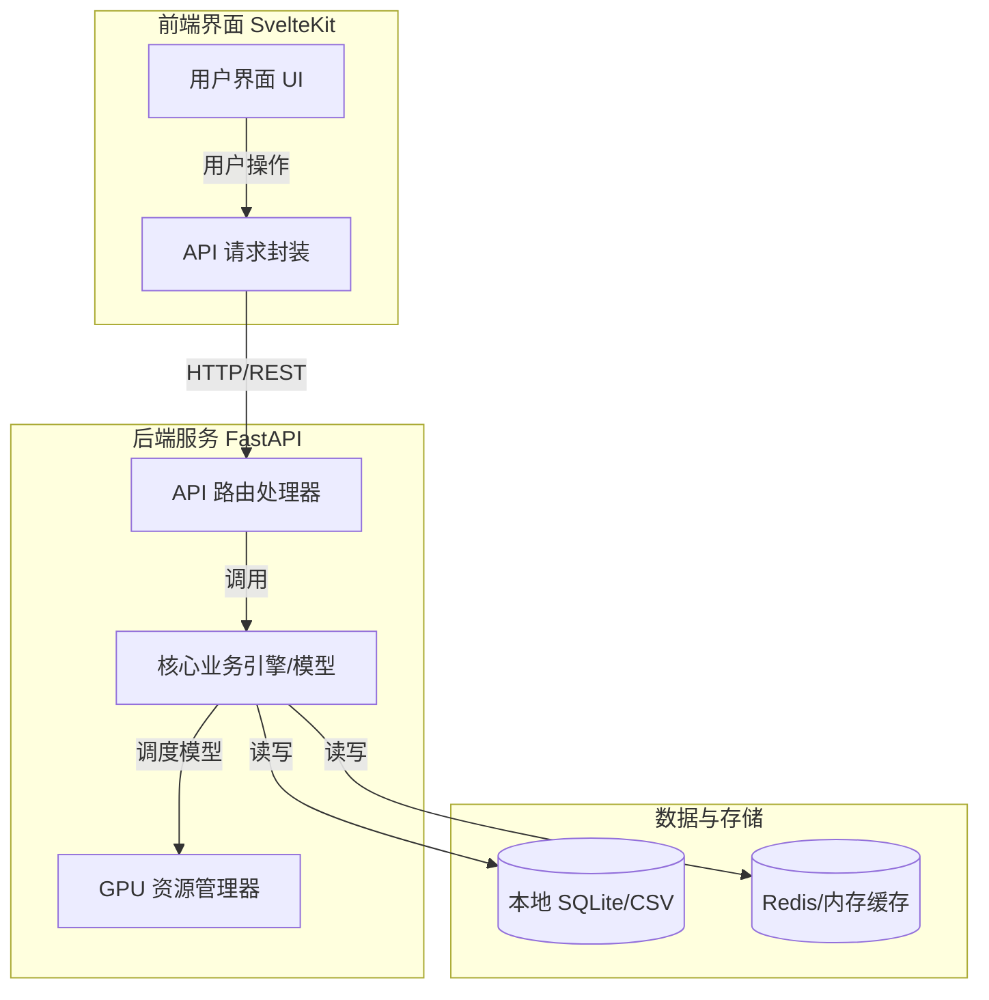
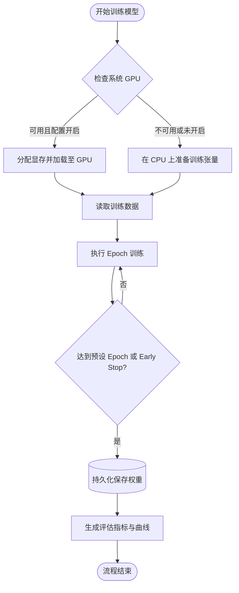
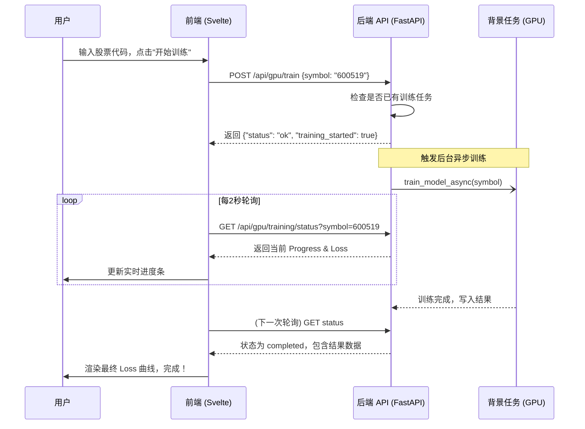

# 项目可视化与文档排版指南 (Mermaid & Markdown)

在软件工程中，清晰的**流程画图**和**结构化排版**是保持项目高可维护性的关键。本技能包提供了一套在项目中通用、标准的制图与排版工作流。

## 一、流程与架构可视化 (Mermaid)

我们强制使用 [Mermaid.js](https://mermaid.js.org/) 语法直接在 Markdown 文档中绘制图表。这保证了图表与代码同源、可版本控制且易于修改。

### 1. 核心系统架构图 (Architecture Diagram)
用于展示系统模块如何交互。

**使用场景**: `README.md` 或 `architecture_overview.md`。

**语法规范**:
- 必须使用 `graph TD` 或 `graph LR` (从上到下或从左到右)。
- 使用子图 (`subgraph`) 对系统进行功能区域划分（如 Frontend, Backend, Database）。
- 关键节点之间用 `-->|动作描述|` 标注数据流向。

**示例代码**:


### 2. 核心业务流程图 (Flowchart)
用于展示某个特定功能（如登录、模型训练）的执行时序或条件分支。

**使用场景**: 功能设计说明书、复杂算法解释。

**语法规范**:
- 采用明确的形状区分：`[执行]`，`(起点/终点)`，`{判断}`，`[(数据库)]`。
- 分支处理时必须清晰提供 `Yes` / `No` 或对应条件。

**示例代码**:


### 3. 系统时序图 (Sequence Diagram)
用于展示前端、后端、第三方 API 之间的时间轴交互。

**示例代码**:


---

## 二、文档排版与书写规范 (Markdown Typography)

良好的文档格式能够极大降低开发者的认知负荷。在本项目的所有 MD 文档中，**强制执行以下排版约定**：

### 1. 结构与层级
- **唯一的大标题**: 每个文档只能有一个 `#` 级别的大标题。
- **层级分明**: 正常章节使用 `##`，子章节使用 `###`。不要越级（不要从 `##` 直接跳到 `####`）。
- **水平分割线**: 在不同的大模块之间使用 `---` 作为视觉分割。

### 2. 空白与间距（中英文排版规则）
- （非硬性要求但强烈推荐）**中英文之间增加一个空格**。例如：“使用 FastAPI 构建 API”。
- **数字与中文之间增加空格**。例如：“包含 3 个核心模块”。
- 避免大段连续文字，善用无序列表 `-` 或有序列表 `1. 2. 3.` 拆分要点。

### 3. 代码引用规范
- **行内代码**: 对变量、文件名、函数名、类名，必须使用单反引号包裹。例如：设置 `settings.USE_GPU = True`。
- **代码块**: 只要超过一行代码，或者包含完整的命令，必须使用带有语言标签的三反引号区块。
    ```python
    def get_gpu_status():
        return {"device": "cuda:0"}
    ```

### 4. 高亮与提示语 (Alerts)
利用 GitHub Flavored Markdown (GFM) 提示块特性，对重要信息进行显眼突出：

> [!NOTE]
> 这是一个补充说明，用于解释为何如此设计。

> [!TIP]
> 这是一个小技巧或最佳实践建议。

> [!WARNING]
> 这个操作可能会有风险或意外副作用，请注意。

> [!CAUTION]
> 极高风险的操作提示（例如：清除数据库）。

### 5. 图标与表情符号 (Emojis)
适当在列表项或小标题前使用 Emoji，能够极大地提高文档的可读性，但不要滥用：
- 🚀 (Rocket): 部署、启动、性能提升
- 📦 (Package): 打包、架构模块
- ⚙️ (Gear): 配置、系统设置
- 🐛 (Bug): 错误修复、已知问题
- 📝 (Memo): 文档书写、记录日志

通过严格遵照上述 **Mermaid 制图范式** 和 **Markdown 排版规范**，我们可以确保项目不仅在代码层面健壮，在知识传承层面同样具备专业级别的可读性。
