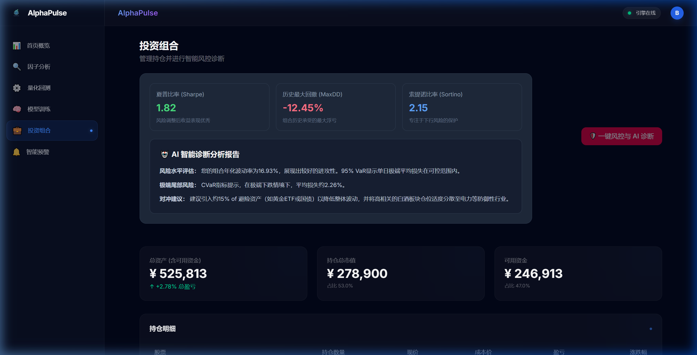
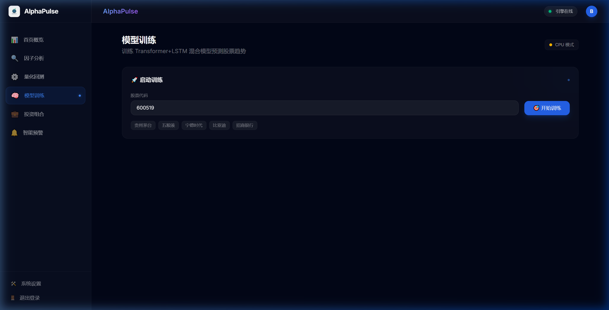
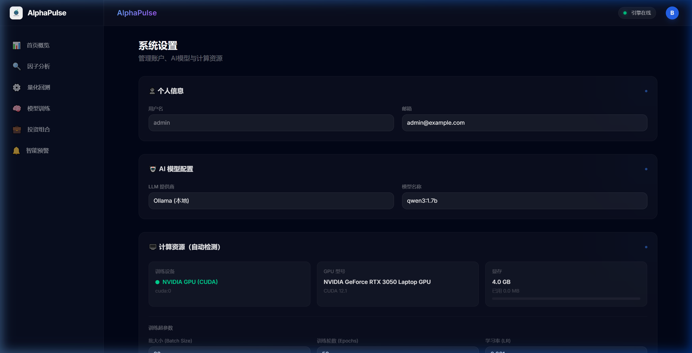

<div align="center">
  <h1>AlphaPulse (StockAnalysis)</h1>
  <p>一个由十几年交易老兵写就的硬核全栈开源量化打靶场</p>
  <p><b>Transformer + LSTM 混合神经网络 × 本地 Ollama 无情风控官</b></p>
</div>

---


## 🚀 核心看点：不仅是工具，更是练兵场

### 1. 给极客的：极致丝滑的全栈 FinTech 靶场
- **极简前端：** 跑满了深色模式的 SvelteKit，抛开臃肿的依赖，渲染极度流畅。
- **高性能引擎：** 粗暴的 Python + FastAPI。从特征清洗到 GPU 显存控制，全套代码公开。
- **原生本地大模型：** 不是调 API！直接对接本地 Ollama（如 `qwen2.5`）。我特调了 Prompt，把复杂的夏普、回撤等数学矩阵硬生生喂给大模型，把它逼成了风控官。想学怎么把真实的业务数据跟大模型的脑子揉合在一起？拆这套骨架就够了。

### 2. 给散户的：带血的赛博“首席风控官”
机构的风控逻辑往往秘不示人。我把它降维抽了出来：
- **直面你的极限亏损 (Max Drawdown)：** 别算百分比。用真实数据告诉你，最倒霉的时候你的账户会白白蒸发掉几万块现大洋。
- **评价你的“性价比” (Sharpe Ratio)：** 天天赌单边，夏普要是负的，说明你冒着倾家荡产的风险，连存银行吃利息都不如。
- **揪出“假分散” (Correlation Matrix)：** 后台极其消耗算力的皮尔逊相关性矩阵，把“穿同一条裤子”的股票全扒出来。一荣俱荣，一跌那就是抱团结伴跳楼。
- **无情的 AI 调仓手术：** 结合这些硬核指标，AI 不会哄你，只会直接下令：砍掉 15% 某高危仓位，全仓切防御型资产！

---

## 🖼️ 看一看，这个系统长什么样？

### 🔥 机构级智能风控面板
左手夏普指数与绝对最大回撤，右手 AI 基于皮尔逊矩阵写出的硬核“防黑天鹅”药方。


### 🧠 深度学习模型训练看板
全自动检测你的显卡！不管是 RTX 还是啥，把参数调好，坐在屏幕前看 Loss 曲线像瀑布一样往下砸。


### ⚙️ 硬件侦测与管理
GPU 的 CUDA VRAM 跑满没跑满？配置中心带可视化进度条。


---

## 🛠️ 安装与运行指南

这套代码虽然硬核，但在你的本地跑起来就一行命令的事。

### 前置要求
1. Python 3.10+ （推荐使用 `uv` 极速包管理器）
2. [Ollama](https://ollama.com/) (建议模型: `qwen2.5:7b-instruct`)
   - 下载并挂在后台服务：`ollama pull qwen2.5:7b-instruct`

### 步骤
> **说明**：为了彻底激活你的 NVIDIA 独立显卡训练功能，建议通过 `pyproject.toml` 中的 `pytorch-cu121` index 参数，强制安装 CUDA 12 适配版的 PyTorch。

```bash
# 1. 克隆代码
git clone https://github.com/YourUsername/StockAnalysis.git
cd StockAnalysis

# 2. 极速安装依赖 (如果你不用 uv，也可以看 pyproject.toml 挨个装)
uv sync

# 3. 首次必须初始化一下本地数据库
uv run python scripts/init_db.py

# 4. 一键启动后端 + Svelte 前端!
uv run python -m backend.main
```

启动后，访问浏览器: [http://localhost:8000](http://localhost:8000)。然后你就可以开玩了。

---

## 🔐 完整能力速览

- **JWT 令牌鉴权与权限树：** `/api/auth/` 支持完整的登录注册、无痛刷新（Refresh Token）以及 Argon2 工业级跨站安全防护。
- **动态显存清理：** `/api/gpu/clear-cache` 可解决在复杂 LSTM 训练中导致的多批次 Out-Of-Memory 问题。
- **一键风控预演：** 基于过去一年回溯与大满贯因子的 `POST /api/portfolio/risk`，可承载巨量持仓请求（含即刻 LRU 极速缓存）。

> 有什么 bug 在 issue 喊我，我晚上有空的时候再修。
> 在这个残酷的市场里，你不能总是赤手空拳。克隆它，去建立属于你自己的兵工厂。
