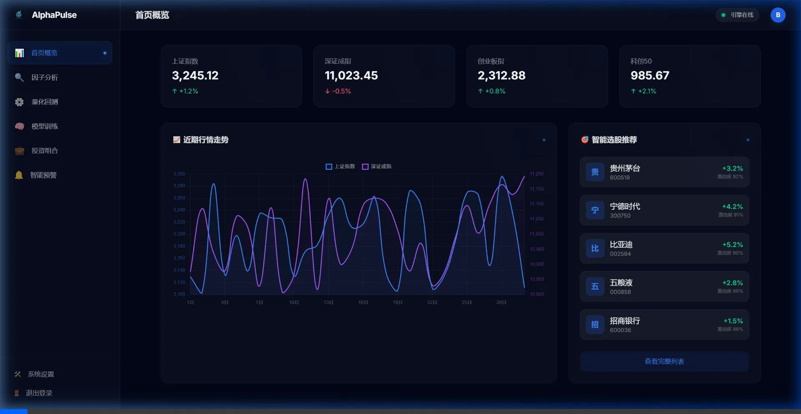
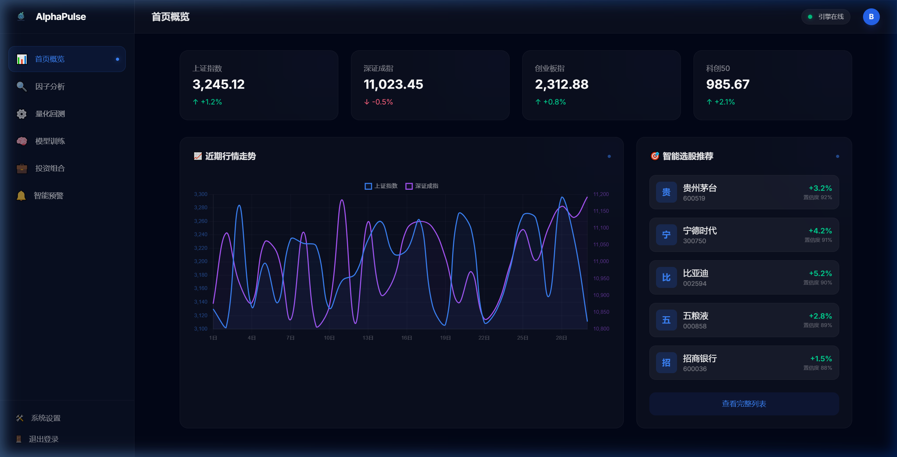
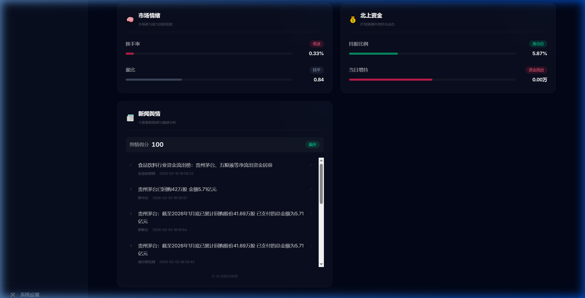
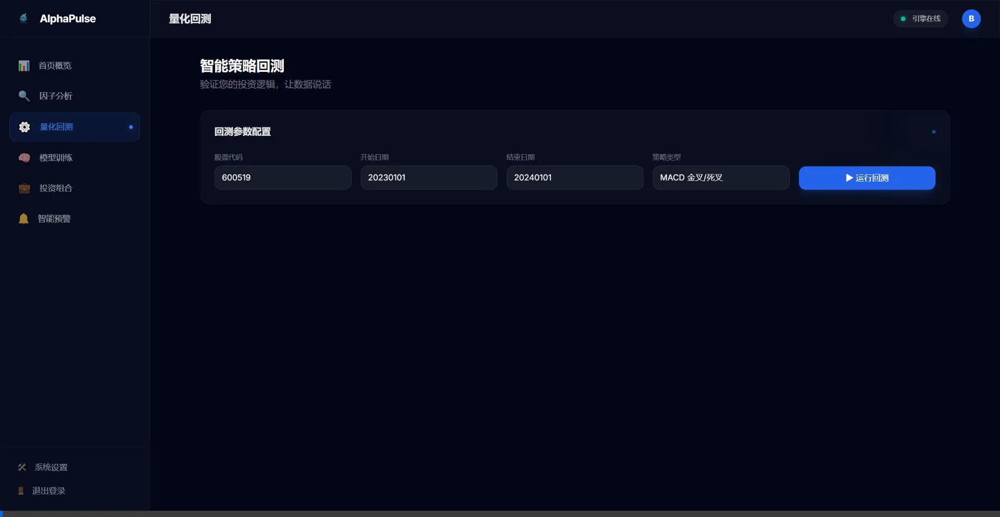
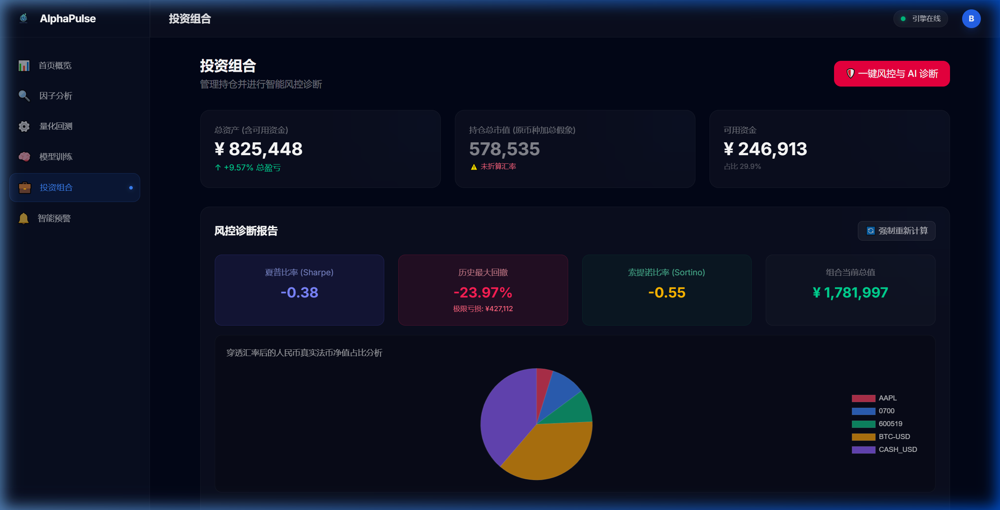
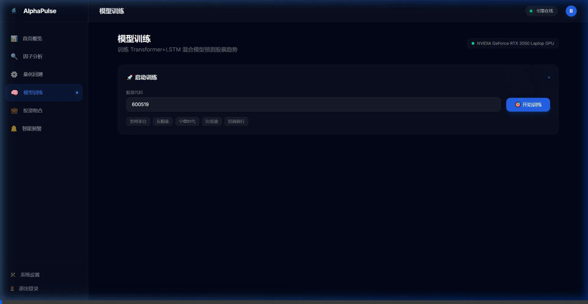
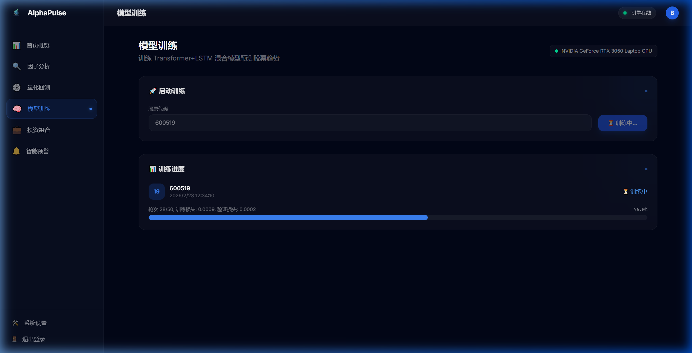

<div align="center">
  
  <h1>AlphaPulse</h1>
  <p><strong>AI 驱动的全栈量化投资分析平台</strong></p>
  <p>Transformer + LSTM 混合深度学习 · 本地大模型智能风控 · 多维因子实时分析</p>

  <br />

  
  
  
  
  
  

</div>

---

## ✨ 项目亮点

<table>
<tr>
<td width="50%">

### 🧠 混合深度学习引擎
自研 **Transformer + LSTM** 双塔混合模型，Transformer 捕捉全局注意力特征，LSTM 提取局部时序动态。支持 **NVIDIA GPU (CUDA)** 加速训练与推理，自动检测显卡并优化显存分配。

</td>
<td width="50%">

### 🤖 本地 AI 风控官
集成本地 **Ollama 大语言模型**（支持 Qwen、DeepSeek 等），将夏普比率、最大回撤、VaR 等复杂的风控数学矩阵注入 Prompt，由 AI 生成机构级的**投资组合诊断报告与调仓建议**。

</td>
</tr>
<tr>
<td width="50%">

### 📊 五维量化因子分析
实时获取 A 股**技术指标 · 基本面 · 市场情绪 · 北上资金 · 新闻舆情**五大类因子数据，并基于关键词 NLP 情感分析生成舆情得分与多空信号，为决策提供全方位数据支撑。

</td>
<td width="50%">

### 🏗️ 生产级全栈架构
FastAPI 异步后端 + SvelteKit 现代前端 + JWT 认证体系 + 审计日志 + SSE 实时进度推送。不是一个玩具 Demo，而是一个可直接部署的**企业级应用骨架**。

</td>
</tr>
</table>

---

## 🖼️ 界面预览

### 🏠 实时大盘与智能解盘
> 刷新即刻获取 A 股重要宽基指数，自带大模型（Ollama）对当前市场情绪的评估与异动个股推荐。


<details>
<summary><b>点击查看高清截图</b></summary>
<br/>


</details>

### 📊 五维因子量化分析
> 快速获取所选标的的 RSI/WR、市值偏离度、北上资金实时流向、以及集成 NLP 情感降维解析的新闻舆情因子。


<details>
<summary><b>点击查看舆情得分分析</b></summary>
<br/>


</details>

### � 全链路历史数据回测
> 构建丝滑的策略调参体验（MACD、RSI），提供精准的净值走势回放与持仓买卖时点流水。



### �🔥 机构级智能风控与 AI 问诊
> 左侧：夏普比率与极端最大回撤等绝对量化指标。右侧：AI 基于底层实时算出的皮尔逊矩阵开出的硬核"防黑天鹅"处方。


<details>
<summary><b>点击查看绝对量化指标视图</b></summary>
<br/>


</details>

### 🧠 混合双塔大模型训练仓
> 原生全自动 NVIDIA GPU 侦测，配备 Transformer + LSTM 参数面板与实时的训练 Loss 瀑布曲线分析。


<details>
<summary><b>点击查看模型阻击视图</b></summary>
<br/>


</details>

---

## 🏛️ 系统架构

```
┌──────────────────────────────────────────────────────────┐
│                    SvelteKit 前端 (v5)                     │
│  首页概览 · 因子分析 · 量化回测 · 模型训练 · 投资组合 · 系统设置   │
└──────────────┬───────────────────────────┬────────────────┘
               │ Vite Proxy / REST API     │ SSE 实时进度
┌──────────────▼───────────────────────────▼────────────────┐
│                  FastAPI 后端引擎                           │
│  ┌─────────┐ ┌──────────┐ ┌──────────┐ ┌──────────────┐  │
│  │ 认证模块 │ │ 数据模块  │ │ 分析模块  │ │ 风控模块      │  │
│  │ JWT/RBAC │ │ AkShare  │ │ 因子引擎  │ │ VaR/CVaR     │  │
│  │ Argon2  │ │ 缓存管理  │ │ NLP 情感  │ │ 皮尔逊矩阵   │  │
│  └─────────┘ └──────────┘ └──────────┘ └──────────────┘  │
│  ┌──────────────────┐  ┌────────────────────────────┐    │
│  │ 深度学习引擎       │  │ 本地大模型 (Ollama)          │    │
│  │ Transformer+LSTM │  │ Qwen / DeepSeek / Llama    │    │
│  │ GPU CUDA 加速     │  │ 智能诊断 · 调仓建议          │    │
│  └──────────────────┘  └────────────────────────────┘    │
└──────────────────────────────────────────────────────────┘
```

---

## 🚀 快速开始

### 前置要求

| 依赖 | 版本 | 说明 |
|------|------|------|
| Python | 3.10+ | 推荐使用 [uv](https://docs.astral.sh/uv/) 包管理器 |
| Node.js | 18+ | 前端构建所需 |
| Ollama | 最新版 | [下载地址](https://ollama.com/)，AI 风控功能所需 |
| NVIDIA GPU | 可选 | 有则自动启用 CUDA 加速训练 |

### 一键启动

```bash
# 1. 克隆项目
git clone https://github.com/jjj2501/StockAnalysis.git
cd StockAnalysis

# 2. 安装后端依赖
uv sync

# 3. 安装前端依赖
cd web && npm install && cd ..

# 4. 拉取 AI 模型 (可选，用于智能风控)
ollama pull qwen3:1.7b

# 5. 启动后端
uv run python -m uvicorn backend.main:app --host 127.0.0.1 --port 8000 --reload

# 6. 启动前端 (新终端)
cd web && npm run dev
```

启动后访问 **http://localhost:3001** 开始使用 🎉

---

## 📋 功能全景

### 核心功能

| 模块 | 功能 | 技术实现 |
|------|------|----------|
| 📊 **因子分析** | 技术面 (RSI/WR/ROC/BB) + 基本面 (市值/行业) + 情绪面 (换手/量比) + 北上资金 + 新闻舆情 | AkShare + NLP 情感分析 |
| 📈 **量化回测** | MACD/RSI 等策略回测，收益曲线、交易信号可视化 | 自研回测引擎 + AI 诊断报告 |
| 🧠 **模型训练** | Transformer + LSTM 混合模型训练，支持超参数配置 | PyTorch + CUDA + SSE 进度推送 |
| 🛡️ **智能风控** | 投资组合 VaR/CVaR 计算、皮尔逊相关矩阵、AI 调仓建议 | Ollama LLM + 数学引擎 |
| 💼 **投资组合** | 多资产组合管理、持仓分析、风险预警 | SQLite + LRU 缓存 |

### 安全与运维

| 特性 | 说明 |
|------|------|
| 🔐 JWT 双 Token 认证 | Access Token + Refresh Token，支持无感刷新 |
| 👤 RBAC 权限控制 | 管理员 / 普通用户角色分离 |
| 🔒 Argon2 密码加密 | 工业级密码哈希方案 |
| 📝 审计日志 | 全量操作审计，自动记录用户行为 |
| 🎛️ GPU 显存管理 | 一键清理 CUDA 显存，解决 OOM 问题 |

---

## 🛠️ 技术栈

<table>
<tr>
<td align="center" width="25%"><b>前端</b></td>
<td align="center" width="25%"><b>后端</b></td>
<td align="center" width="25%"><b>AI / ML</b></td>
<td align="center" width="25%"><b>数据</b></td>
</tr>
<tr>
<td>

- SvelteKit 5
- Tailwind CSS 4
- Chart.js
- Vite

</td>
<td>

- FastAPI
- SQLite + SQLAlchemy
- Uvicorn (ASGI)
- Pydantic

</td>
<td>

- PyTorch (CUDA)
- Transformer + LSTM
- Ollama (Qwen/DeepSeek)
- NLP 情感分析

</td>
<td>

- AkShare (A 股行情)
- 东方财富实时数据
- Parquet 本地缓存
- 增量数据更新

</td>
</tr>
</table>

---

## 📁 项目结构

```
StockAnalysis/
├── backend/                  # Python 后端
│   ├── api/                  #   API 路由层 (RESTful + SSE)
│   ├── auth/                 #   认证授权 (JWT + RBAC + 审计)
│   ├── core/                 #   核心业务逻辑
│   │   ├── model.py          #     Transformer+LSTM 混合模型
│   │   ├── engine.py         #     训练 & 推理引擎
│   │   ├── data.py           #     数据获取 & 因子计算
│   │   ├── backtester.py     #     回测引擎
│   │   ├── risk.py           #     风控计算 (VaR/CVaR)
│   │   ├── llm.py            #     LLM 集成 (Ollama)
│   │   └── gpu_utils.py      #     GPU 管理工具
│   └── main.py               #   应用入口
├── web/                      # SvelteKit 前端
│   └── src/routes/           #   页面路由
│       ├── factors/          #     因子分析
│       ├── backtest/         #     量化回测
│       ├── training/         #     模型训练
│       ├── portfolio/        #     投资组合
│       └── settings/         #     系统设置
├── docs/                     # 文档 & 截图
└── pyproject.toml            # 项目配置
```

---

## 🗺️ 路线图

- [x] Transformer + LSTM 混合模型训练 & 推理
- [x] 五维量化因子分析 (技术/基本面/情绪/北上/新闻)
- [x] 本地 Ollama 大模型智能风控
- [x] 投资组合风险管理 (VaR/CVaR)
- [x] 完整 JWT 认证 & RBAC 权限体系
- [x] GPU CUDA 加速与显存管理
- [ ] K 线图表与技术指标叠加
- [ ] 多策略组合回测框架
- [ ] 实时行情 WebSocket 推送
- [ ] Docker 一键部署方案

---

## 🤝 参与贡献

我们欢迎任何形式的贡献！

1. **Fork** 本仓库
2. 创建你的特性分支：`git checkout -b feature/amazing-feature`
3. 提交变更：`git commit -m 'feat: 添加某个很棒的功能'`
4. 推送到分支：`git push origin feature/amazing-feature`
5. 提交 **Pull Request**

---

## 📄 许可证

本项目采用 [MIT License](LICENSE) 开源许可证。

---

<div align="center">
  <p>
    <strong>在这个残酷的市场里，你不能总是赤手空拳。</strong>
  </p>
  <p>
    克隆它，去构建属于你自己的量化武器库。
  </p>
  <br />
  <sub>⭐ 如果这个项目对你有帮助，请给一个 Star 支持一下！</sub>
</div>
