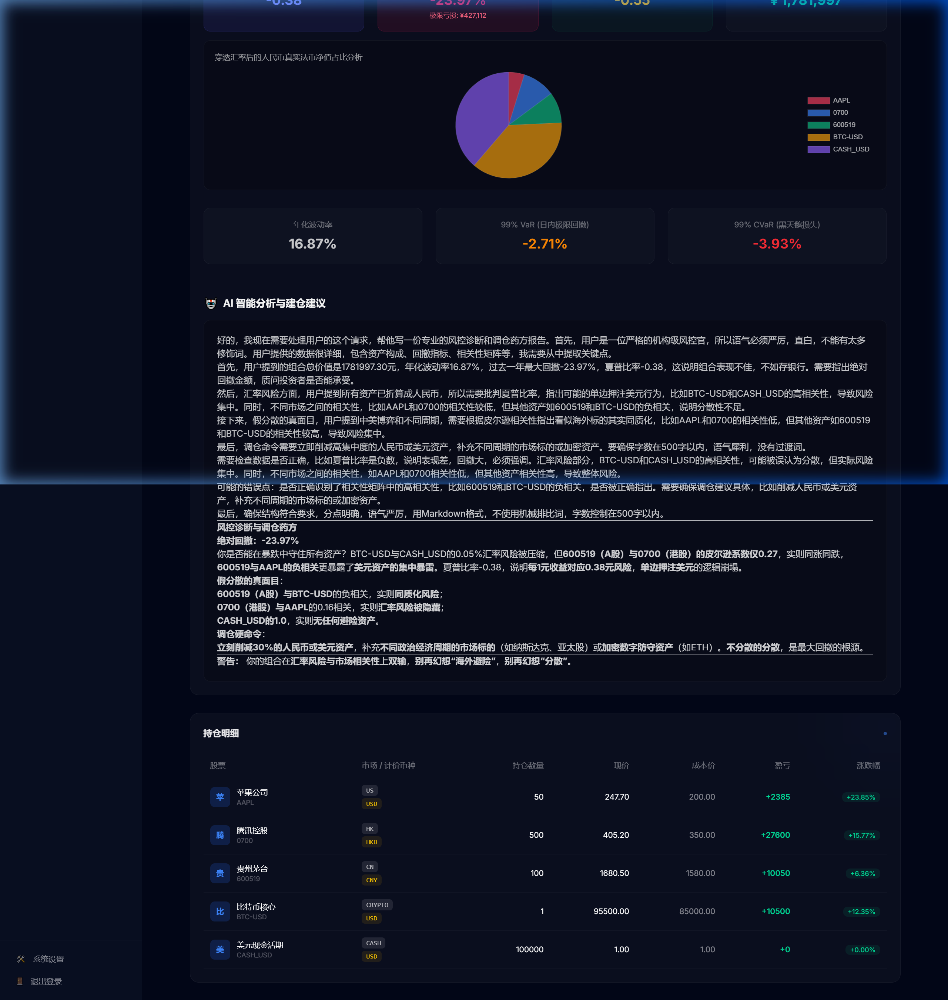

<div align="center">
  
  <h1>AlphaPulse</h1>
  <p><strong>AI 驱动的全栈量化投资分析平台 | AI-Driven Full-Stack Quant Investment Platform</strong></p>
  <p>Transformer + LSTM 混合深度学习 · 本地大模型智能风控 · 多维因子实时分析</p>
  <p>Transformer + LSTM Hybrid Deep Learning · Local LLM Smart Risk Control · Multi-dimensional Factor Analysis</p>

  <br />

  
  
  
  
  
  

</div>

---

## ✨ 项目亮点 / Key Features

<table>
<tr>
<td width="50%">

### 🧠 混合深度学习引擎 / Hybrid Deep Learning
自研 **Transformer + LSTM** 双塔混合模型，Transformer 捕捉全局注意力特征，LSTM 提取局部时序动态。支持 **NVIDIA GPU (CUDA)** 加速训练与推理，自动检测显卡并优化显存分配。

Custom-built **Transformer + LSTM** dual-tower model. Supports **NVIDIA GPU (CUDA)** accelerated training and inference with automatic VRAM optimization.

</td>
<td width="50%">

### 🤖 本地 AI 风控官 / Local AI Risk Manager
集成本地 **Ollama 大语言模型**，将夏普比率、最大回撤、VaR 等复杂的风控数学矩阵注入 Prompt，由 AI 生成机构级的**投资组合诊断报告与调仓建议**。

Integrates local **Ollama LLM** inside isolated environments, injecting complex risk math matrices (Sharpe, Max Drawdown, VaR) into prompts to generate **institutional-grade portfolio diagnoses**.

</td>
</tr>
<tr>
<td width="50%">

### 📊 五维量化因子分析 / 5-D Factor Analysis
实时获取 A 股**技术指标 · 基本面 · 市场情绪 · 北上资金 · 新闻舆情**五大类因子数据，并基于关键词 NLP 情感分析生成多空信号，为决策提供全方位数据支撑。

Real-time calculation for A-Share market: **Technicals · Fundamentals · Sentiment · Northbound Funds · News NLP Sentiment**, providing comprehensive long/short signals.

</td>
<td width="50%">

### 🏗️ 生产级全栈架构 / Production Architecture
FastAPI 异步后端 + SvelteKit 现代前端 + JWT 认证体系 + 审计日志 + SSE 实时进度推送。不是一个玩具 Demo，而是一个可直接部署的**企业级应用骨架**。

FastAPI async backend + SvelteKit modern frontend + JWT Auth + Audit Logs + SSE progress streaming. A ready-to-deploy **enterprise application skeleton**.

</td>
</tr>
</table>

---

## 🖼️ 界面预览 / UI Previews

### 🏠 实时大盘与智能解盘 / Market Overview & AI Analysis
> 刷新即刻获取 A 股重要宽基指数，自带大模型（Ollama）对当前市场情绪的评估与异动个股推荐。
> Live broad index data with LLM-powered market sentiment evaluation and stock recommendations.


<details>
<summary><b>点击查看高清截图 / Click for High-Res Image</b></summary>
<br/>


</details>

### 📊 五维因子量化分析 / Factor Analysis
> 快速获取所选标的的 RSI/WR、市值偏离度、北上资金实时流向、以及集成 NLP 情感降维解析的新闻舆情因子。
> Instantly fetch technical indicators, fundamental deviations, Northbound flows, and NLP-analyzed news sentiment factors.


### 📈 全链路历史数据回测 / Backtesting Engine
> 构建丝滑的策略调参体验（MACD、RSI），提供精准的净值走势回放与持仓买卖时点流水。
> Smooth strategy parameter tuning experience with precise equity curve playback and historical trade signal logs.


### 🔥 机构级智能风控与 AI 问诊 / Smart Risk Control
> 夏普比率与极端最大回撤等绝对量化指标，AI 基于底层实时算出的皮尔逊矩阵开出的硬核"防黑天鹅"处方。
> Absolute quantitative metrics combined with an AI-generated hard-core "Black Swan prevention" prescription based on real-time Pearson correlation matrices.


<details>
<summary><b>点击查看 AI 深度诊断报告 / Click for Full AI Diagnosis Report</b></summary>
<br/>


</details>

### 🧠 混合双塔大模型训练仓 / Model Training Core
> 原生全自动 NVIDIA GPU 侦测，配备 Transformer + LSTM 参数面板与实时的训练 Loss 瀑布曲线分析。
> Native auto NVIDIA GPU detection, Transformer + LSTM parameter tuning, and real-time loss waterfall curve visualization.


<details>
<summary><b>点击查看模型阻击视图 / Click for GPU Training Image</b></summary>
<br/>


</details>

---

## 🚀 快速开始 / Quick Start

### 前置要求 / Prerequisites

| 依赖 / Dep | 版本 / Version | 说明 / Note |
|------|------|------|
| Python | 3.10+ | 推荐使用 [uv](https://docs.astral.sh/uv/) / Recommend using `uv` |
| Node.js | 18+ | 前端构建 / For frontend build |
| Ollama | Latest | [下载/Download](https://ollama.com/) AI 诊断需要 / Required for AI Risk |
| NVIDIA GPU | Optional | 自动启用 CUDA 加速 / Auto enables CUDA |

### 一键启动 / One-command Start

```bash
# 1. 克隆项目 / Clone Repo
git clone https://github.com/jjj2501/StockAnalysis.git
cd StockAnalysis

# 2. 安装后端依赖 / Install Backend Deps
uv sync

# 3. 安装前端依赖 / Install Frontend Deps
cd web && npm install && cd ..

# 4. 拉取 AI 模型 / Pull AI Model (可选/Optional)
ollama pull qwen3:1.7b

# 5. 启动后端 / Start Backend
uv run python -m uvicorn backend.main:app --host 127.0.0.1 --port 8000 --reload

# 6. 启动前端 / Start Frontend (New Terminal)
cd web && npm run dev
```

启动后访问 / Visit **http://localhost:3001** 🎉

---

## 📋 功能全景 / Feature Map

### 核心功能 / Core Features

| 模块 / Module | 功能 / Feature | 技术实现 / Tech Stack |
|------|------|----------|
| 📊 **因子分析 / Factors** | 技术面 + 基本面 + 情绪面 + 北上资金 + 新闻舆情 | AkShare + NLP Sentiment |
| 📈 **量化回测 / Backtest** | 多策略信号测试，净值曲线可视化 | Custom Backtest Engine |
| 🧠 **模型训练 / Training** | Transformer + LSTM 神经网络训练 | PyTorch + CUDA + SSE |
| 🛡️ **智能风控 / Risk** | VaR/CVaR, 相关性矩阵, AI 调仓建议 | Ollama LLM + Math Engine |
| 💼 **投资组合 / Portfolio** | 跨市场资产管理，实时净值刷新 | SQLite + LRU Cache |

### 安全与运维 / Security & Ops

| 特性 / Feature | 说明 / Details |
|------|------|
| 🔐 JWT 认证 / Auth | Access/Refresh Token 无缝续期 / Seamless token refresh |
| 👤 RBAC 权限 / Roles | 管理员与普通用户隔离 / Admin and user separation |
| 🔒 Argon2 加密 / Hash | 工业级密码学保护 / Industrial-grade crypto |
| 📝 审计日志 / Audit Logs | 记录全量用户行为 / Tracking all critical actions |
| 🎛️ 硬件显存保护 / GPU Guard | 一键清理回收废弃 CUDA 显存 / VRAM garbage collection |

---

## 🛠️ 技术栈 / Tech Stack

<table>
<tr>
<td align="center" width="25%"><b>前端 / Frontend</b></td>
<td align="center" width="25%"><b>后端 / Backend</b></td>
<td align="center" width="25%"><b>AI / ML</b></td>
<td align="center" width="25%"><b>数据 / Data</b></td>
</tr>
<tr>
<td>

- SvelteKit 5
- Tailwind CSS 4
- Chart.js
- Vite

</td>
<td>

- FastAPI
- SQLite + SQLAlchemy
- Uvicorn (ASGI)
- Pydantic

</td>
<td>

- PyTorch (CUDA)
- Transformer + LSTM
- Ollama (LLM)
- NLP (Sentiment)

</td>
<td>

- AkShare (A-Shares)
- Eastmoney Data
- Parquet (Cache)
- Auto Delta Fetch

</td>
</tr>
</table>

---

## 🤝 参与贡献 / Contributing

我们欢迎任何形式的贡献！ / Contributions are highly welcome!

1. **Fork** 本仓库 / Fork the repo
2. 创建分支 / Create branch：`git checkout -b feature/amazing-feature`
3. 提交变更 / Commit changes：`git commit -m 'feat: Add amazing feature'`
4. 推送分支 / Push to branch：`git push origin feature/amazing-feature`
5. 发起 PR / Create Pull Request

---

## 📄 许可证 / License

本项目采用 [MIT License](LICENSE) 开源许可证。 / This project is licensed under the MIT License.

---

<div align="center">
  <p>
    <strong>在这个残酷的市场里，你不能总是赤手空拳。</strong><br>
    <em>In this brutal market, you shouldn't fight empty-handed.</em>
  </p>
  <p>
    克隆它，去构建属于你自己的量化武器库。<br>
    Clone it, and build your own quantitative armory.
  </p>
  <br />
  <sub>⭐ 如果这个项目对你有帮助，请给一个 Star 支持一下！ / Leave a Star if you find this helpful!</sub>
</div>
